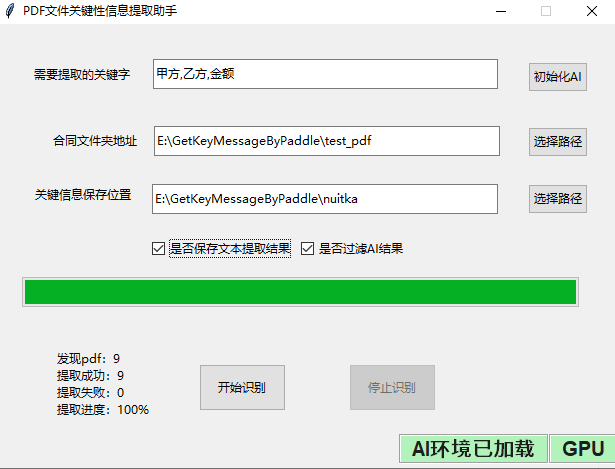

本项目实践[审计场景下合同关键信息批量提取](https://aistudio.baidu.com/projectdetail/4434018?contributionType=1),并作适当修改

**修改内容如下**：

- [x] 原始项目至只能对图片进行分析，新增对pdf文件进行分析
- [x] 原始项目只能对1张图片分析，新增对多张图片分析
- [x] 新增扫描一个文件夹下所有pdf文件的功能
- [x] 新增将识别结果保存到csv中的过程
- [x] 设计界面
- [x] 打包发布


**助手使用**

1. **初始化AI：** 设定需要提取的关键字信息，并初始化AI
2. **选择PDF目录：** 选择待分析的PDF文件夹地址
3. **选择结果保存目录：** 选择结果保存位置，包括中间结果及汇总结果`output.csv`
4. **是否保存文本提取结果：** 整个过程的第一步，将每页PDF转换为文本
5. **是否过滤AI结果：** 由于PDF文档的原因，AI输出有重复，勾选这个对这些值进行过滤

**项目打包过程**

1. 使用[Tkinter布局助手](https://www.pytk.net)设计UI
2. 实现前后台逻辑功能
3. 使用nuitka打包项目


**nuitka打包命令**

```bash
python -m nuitka --onefile --mingw64 --show-memory --show-progress --show-modules --enable-plugin=pylint-warnings --windows-company-name=EHOLLY --enable-plugin=tk-inter  --nofollow-import-to=paddle --nofollow-import-to=paddleocr --nofollow-import-to=paddlenlp --windows-product-name=GetPDFKeyInformation --windows-file-version=0.0.1 --windows-product-version=0.0.1  --windows-file-description="PDF关键信息提取工具" main.py
```

**更新日志**
v0.0.1 实现基本功能

